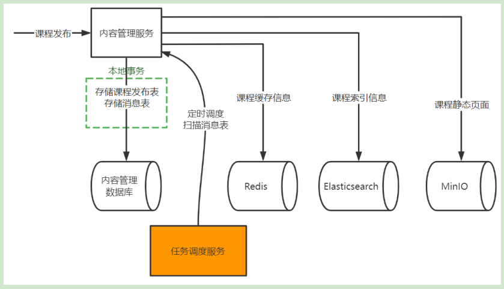
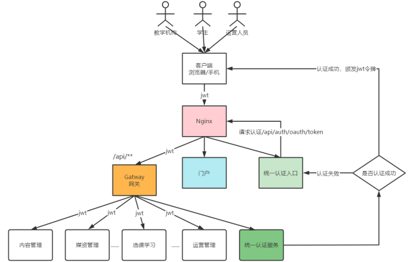
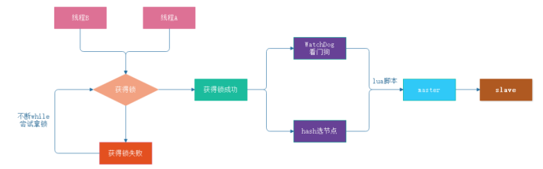
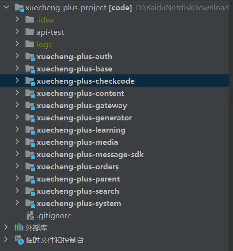

# 			学成在线

# bug

测试主类不加注解@SpringBootTest 会报空

测试框架加载失败 运行-编辑配置-更换jdk

xxl-job任务调度失败，更换执行器的注册ip地址

### 采用的技术

前后端分离，JSR303校验课程信息是否正确，GateWay网关，Nacos进行服务配置和管理，Swagger文档生成和测试。

minio存储照片视频，FFmpeg进行视频转码将上传的视频avi转为mp4，xxl-job做分布式任务调度处理上传的视频。

课程预览采用Freemarker模板引擎并作出静态化 。

上传静态页面使用Feign进行远程调用媒资服务的minio上传，校验验证码使用Feign进行远程调用验证码模块的校验方法。

通过本地部署的nacos访问主站静态资源和访问课程视频和图片（以后换文件位置记得改配置文件）。

课程发布采用分布式事务调度。

发布后的课程：redis存放课程缓存信息，Elasticsearch存放课程索引，minio存放课程静态页面。

​							保证AP，提交后向发布表和消息表存数据，采用任务调度的方式，定时 调度扫描消息表，向下面							三个内容存放。

在内容模块保存静态页面 调用媒资模块的上传到minio方法中，采用Hystrix框架实现熔断（fallbackFactory），降级处理（MediaServiceClientFallbackFactory）。防止微服务雪崩。

使用elasticsearch作为课程索引，采用任务调度方式使用canal实现索引同步，将mysql数据同步到es。

使用Spring Security+OAuth2作认证授权，用授权码模式和密码模式,成功登陆后采用JWT令牌做无状态认证（资源服务自行校验令牌，性能高），由网关统一认证是否下发到微服务，验证码保存在redis，授权采用RBAC按照资源的访问控制。

​                                          		

使用内网穿透工具natapp生成支付二维码，用支付宝的沙箱环境模拟支付，项目采用RabbitMQ作消息队列，实现支付成功后通知添加课程到课程表。

采用HTTPClient作接口测试，采用JMeter作压力测试，优化性能： 将日志级别降低。不用登陆就能访问到课程发布信息，放到redis缓存中。

# 知识点

事务失效：方法内异常未抛出

​					非事务方法调用事务方法

​					事务方法调用事务方法

​					方法非public

断点续传：前端对文件进行分块

​					一块一块上传，交给后端校验是否已经上传（用md5值）

​					所有分块上传后，后端进行合并，并校验文件完整性

处理异常：

​				自定义一个统一异常处理器去捕获异常

​				控制器增加注解@ControllerAdvice @ExceptionHandler

分布式任务调度：多台电脑进行，隔一段指定的时间执行一次任务

​					目标：性能高，有电脑坏了不影响使用，弹性扩容，对任务进行监测，避免任务重复执行。

分布式事务:不同的服务通过网络通信进行事务控制。当出异常后本地事务可回滚，但远程调用的事务不可回滚。

​					解决此问题需保证CP或AP。 

​					

CAP理论：C 一致性 用户不管访问哪个服务拿到数据都是最新的。

​				   A 可用性 任何时候查询用户信息都可以查询到结果，但不一定是最新的。

​				   P 分区容忍性 系统采用分布式架构时由于网络通信异常导致请求中断、消息丢失，但系统依然对外提										  供服务。

​				  CP 强调一致性 面对面支付，必须立马到账。

​				  AP 强调可用性 今日退款，明日到账。

页面静态化：因为课程发布后会供很多人点击，所以进行页面静态化。

​						将页面生成提前，放在nginx，apache服务器中，性能高。

熔断降级：解决微服务雪崩（一个微服务出现错误，整体不能用）。

​					下游服务异常发生熔断，上游服务因为熔断所以降级调用其他方法。

网关功能：路由转发，认证校验令牌合法性，维护一份白名单

Canal：根据数据库日志写入es索引。

Spring Security ：身份验证和访问控制框架。

Oauth2：一个标准的开放的授权协议，提供授权码模式、密码模式、简化模式、客户端模式等四种授权模式。

缓存穿透：大量并发去访问一个数据库不存在的数据，由于缓存中没有该数据导致大量并发查询数据库。

​				解决：1.使用布隆过滤器，将redis中的key放到过滤器中，查数据先查过滤器，过滤器返回0则永不再									查询

​								 2.就算数据不存在，也直接存在redis中，下次查询就直接返回null。（得设置过期时间）

​								 3.对查询的数据设置校验机制。								

缓存雪崩：大量key拥有了相同的过期时间，当缓存中大量key失效后当高并发到来时导致大量请求到数据库，瞬					间耗尽数据库资源，导致数据库无法使用。

​					解决：1.给key过期时间加随机数。

​								2.缓存预热，设置定时任务将数据库同步到缓存

​								3.给查询数据库的线程设置同步锁。

缓存击穿：大量并发访问同一个热点数据，当热点数据失效后同时去请求数据库，瞬间耗尽数据库资源，导致数据					库无法使用。

​					解决：1.设置热点数据永不过期

​								2.给查询数据库的线程设置同步锁。

分布式锁：虚拟机都去抢占同一个锁，锁是一个单独的程序提供加锁、解锁服务，谁抢到锁谁去查询数据库

​				    实现：1、基于数据库实现分布锁

​										利用数据库主键唯一性的特点

​								2、基于redis实现锁 SETNX、redisson等。

​									 	SETNX：key不存在才能设置key的值 （缺乏原子性）

​										 Redisson：获取锁失败，通过while不断尝试。获取锁后会启动看门狗给锁不断续时间，															直到任务完成。任务完成后启动lua脚本，保证原子性。

​								3、使用zookeeper实现

​										zookeeper的结构类似的文件目录，多线程向zookeeper创建一个子目录(节点)只会有一个										创建成功。

如何解决跨域问题？：通过Nginx代理

@ResponseBody 返回JSON数据

@RequestBody 将JSON数据转成java对象

@Controller 返回值是跳转页面

@RestController 返回值是JSON数据

@PathVarible 获取url中的占位符的值

@Compoent 定义Bean

auth 认证授权模块

base 基础工程

content 内容管理

checkcode 验证码

gateway 网关

generator 被复制的	

learning 选课

meida 媒资

message-sdk 消息模块

orders 关于支付的订单模块

parent 父类 管理依赖

search 搜索 es索引

system 前后端联调
